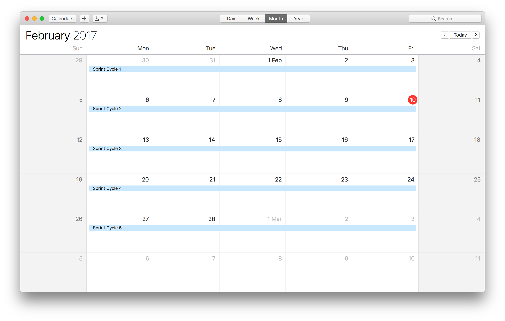

# Sprint Cycles
A sprint deliverable is the creative presentation of your concepts and progress, shipped every end of the work week (Preferably, Wednesdays). One sprint cycle could equivalent to 5 days for a busy digital agency. The number of sprint cycles for every client may slightly vary due to the unique nature of the different problems you need to solve - there is no one-size-fits-all solution for this one. But what we do have, is a collection of guidelines for every level of the branding sprint cycle.

For startups, you could try and fit all of these in 5 days!

Monday - Kickoff
Tuesday - Sprint Lvl 1
Wednesday - Sprint Lvl 2
Thursday - Sprint Lvl 3
Friday - Assets Delivery

This works great, especially if the stakeholders are the co-founders in your startup :)

In this section, we'll discuss some of the common pitfalls and scenarios that would happen incase things would not go exactly as planned.